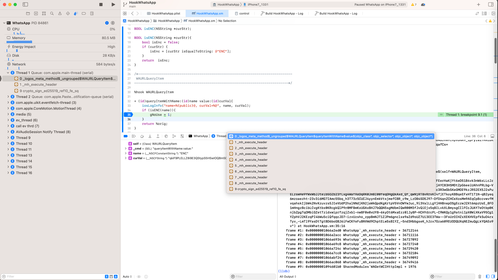
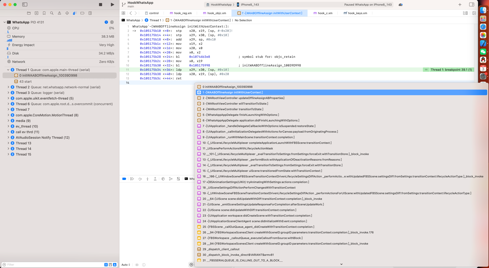
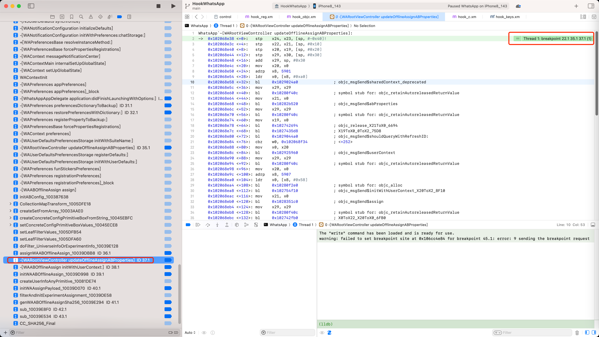
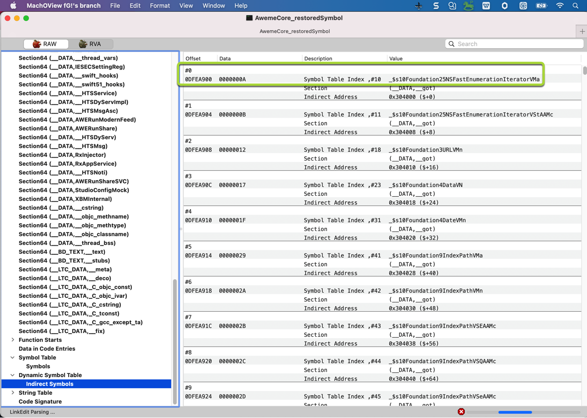
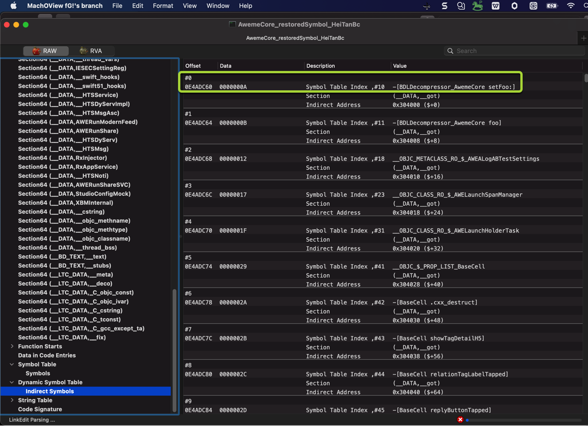
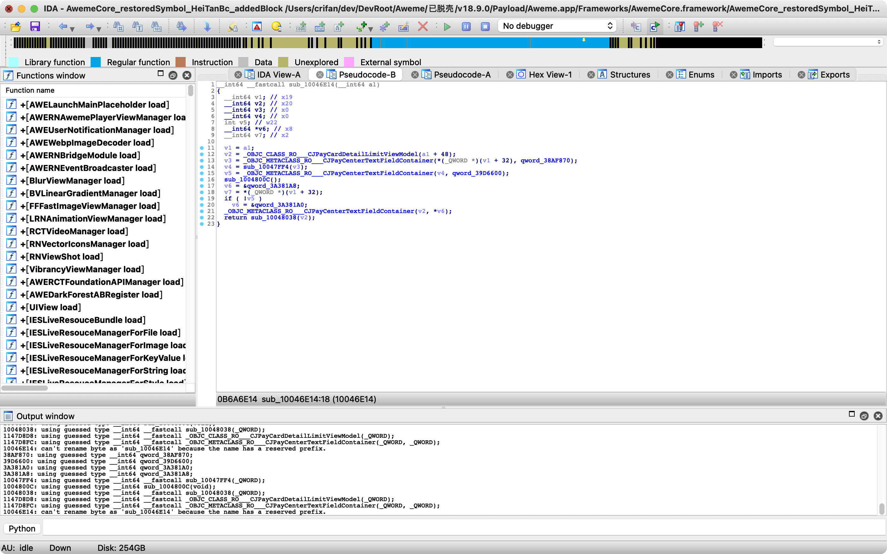
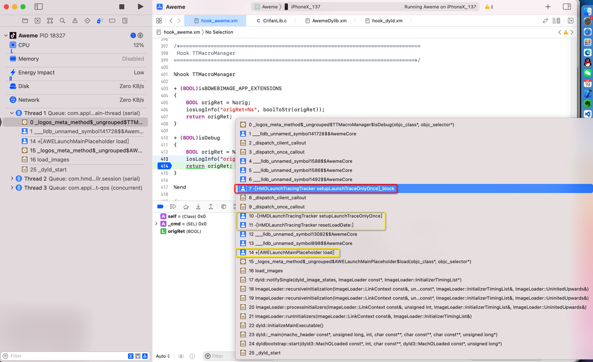

# 恢复符号表前后对比

## 恢复符号表之前

* 效果
  * Xcode调试iOS程序 -》 查看函数调用堆栈 -》只能看到无名函数或错误的函数名 -》 无法看到期望的（ObjC等）函数名
    * 
  * Xcode给iOS的ObjC函数加断点
    * 通过（ObjC的）函数名加断点，加不上
      * 
    * 给ObjC的函数加断点，只能用
      * lldb无名函数`___lldb_unnamed_symbol1$$AwemeCore`
      * 或（计算出的实际的）地址

## 恢复符号表之后

* 效果
  * Xcode调试iOS程序 -》 查看函数调用堆栈 -》就能看到函数名了
    * 
  * Xcode给iOS的ObjC函数加断点 -》断点就能加上了
    * 举例
      * WhatsApp
        * `-[WARootViewController updateOfflineAssignABProperties]`
          * 
      * AwemeCore
        * 用ObjC函数名：`+[AWELaunchMainPlaceholder load]`

## 用工具辅助验证

且可以用其他工具辅助验证：的确加上了函数名=符号表了：

* MachOView
  * `Dynamic Symbol Table`->`Indirect Symbols`
    * 之前=没有恢复符号表：`AwemeCore_noSymbol`、`AwemeCore_restoredSymbol`
      * 
   * 之后=已恢复符号表：`AwemeCore_restoredSymbol_HeiTanBc`
      * 
* IDA
  * 之后=已恢复符号表：`AwemeCore_restoredSymbol_HeiTanBc`
    * 
* (Xcode中)lldb
  * 
