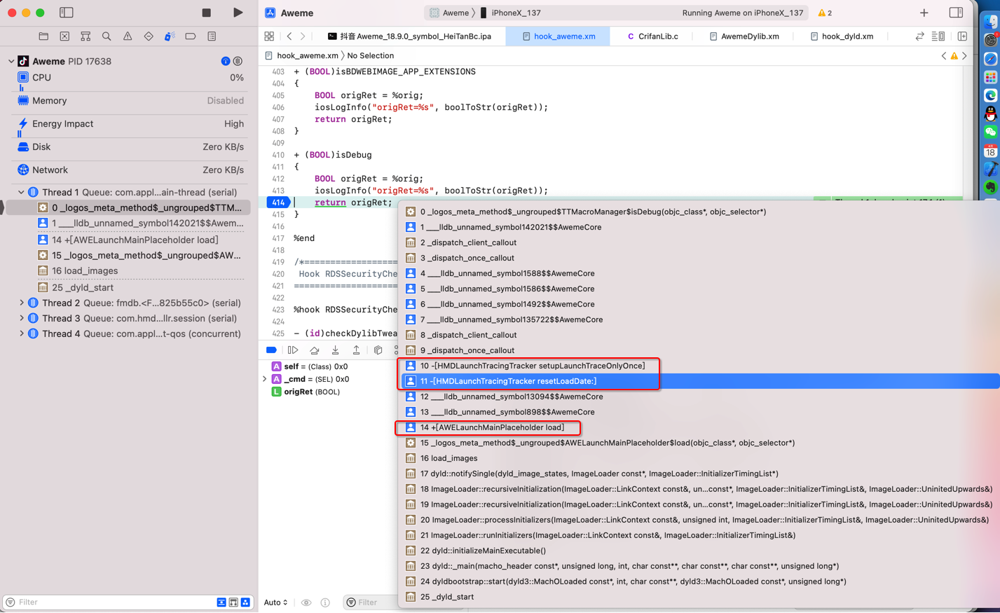
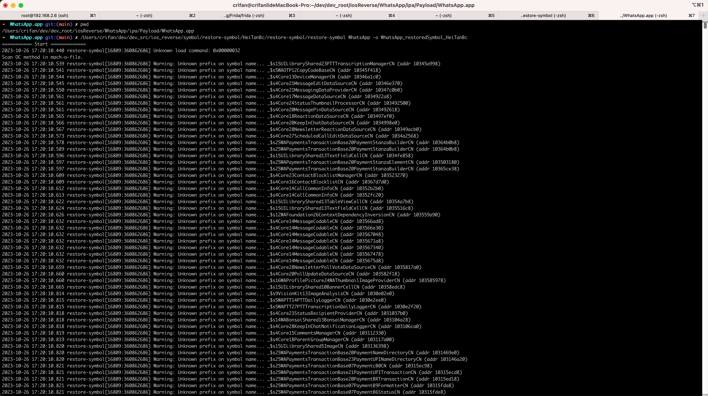
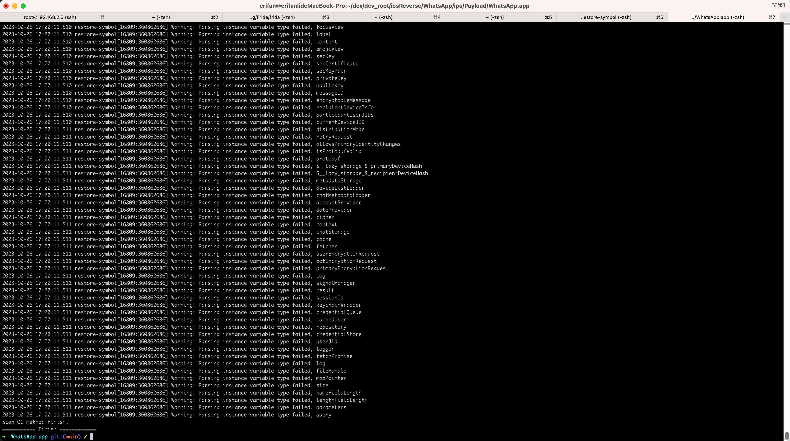
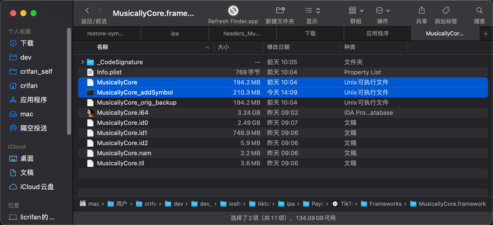
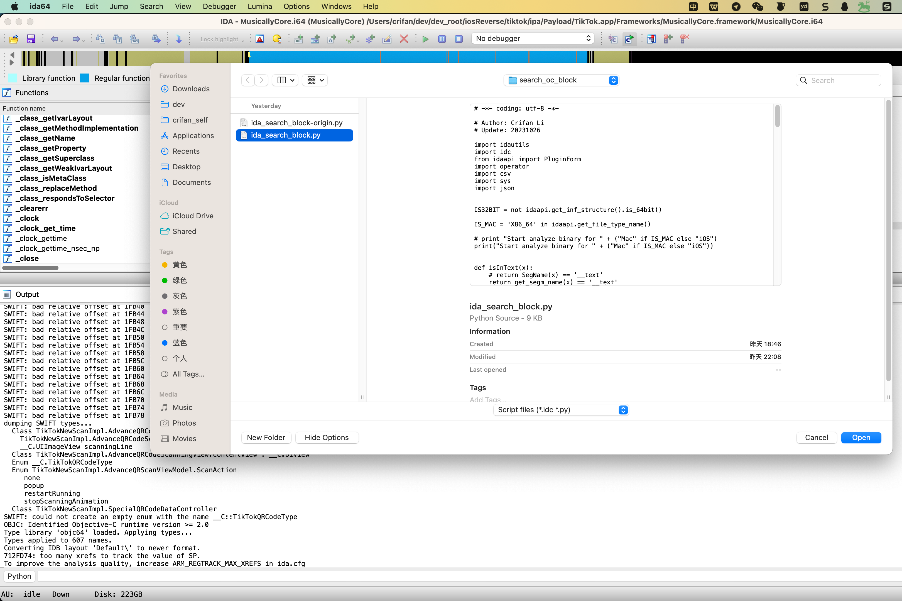
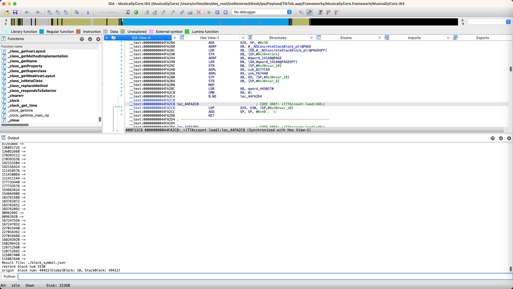
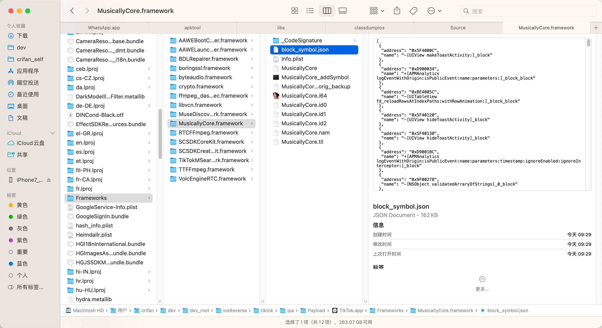
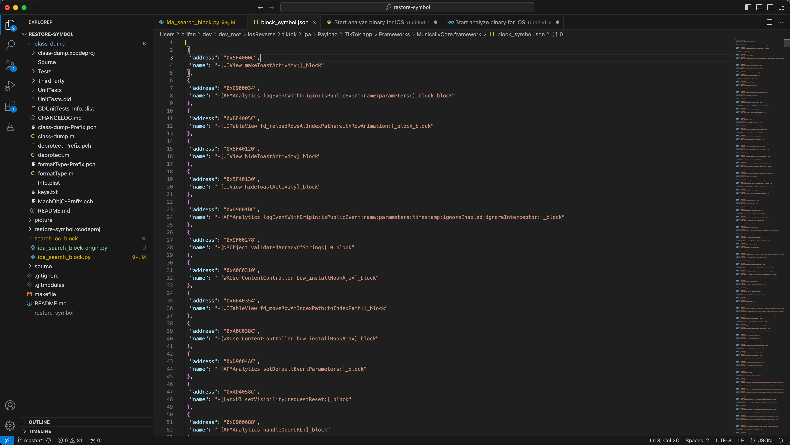
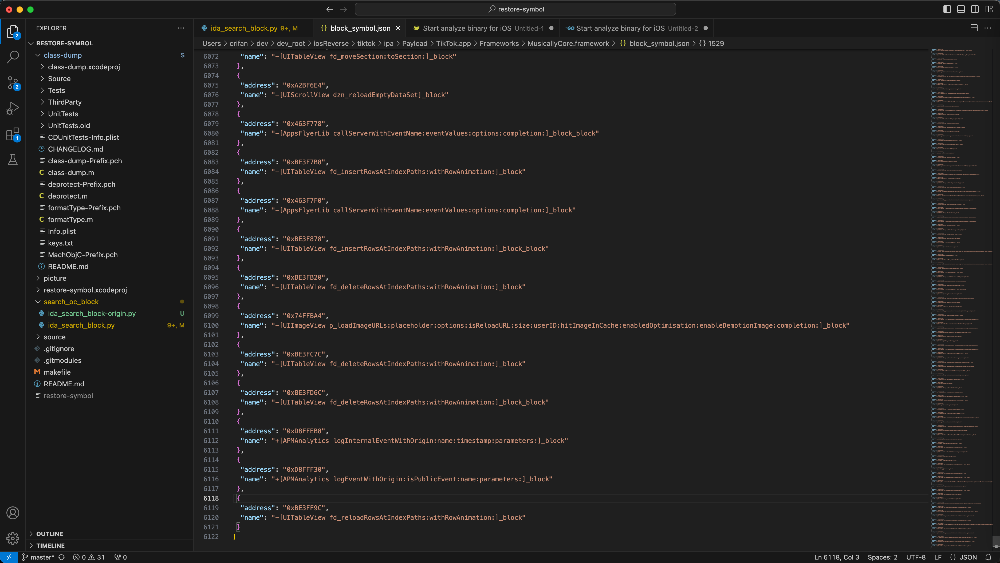

# 举例

下面举例说明：

## 用restore-symbol恢复ObjC符号表

### AwemeCore

```bash
➜  AwemeCore.framework /Users/crifan/dev/DevSrc/iOS/restore-symbol/HeiTanBc/restore-symbol/restore-symbol AwemeCore_noSymbol -o AwemeCore_restoredSymbol_HeiTanBc
=========== Start =============
Scan OC method in mach-o-file.
Scan OC method finish.
restore 329610 symbols
=========== Finish ============
```

#### 效果

抖音的AwemeCore恢复符号表后的效果：

之前通过恢复符号表，把部分AwemeCore的函数，从lldb无名函数：

```bash
frame #10: 0x00000001062dc7cc AwemeCore`___lldb_unnamed_symbol1799$$AwemeCore + 100
frame #11: 0x00000001062dc744 AwemeCore`___lldb_unnamed_symbol1798$$AwemeCore + 48
frame #14: 0x0000000106284054 AwemeCore`___lldb_unnamed_symbol1$$AwemeCore + 84
```

变成了有名字的函数：

```bash
frame #10: 0x00000001084847cc AwemeCore`-[HMDLaunchTracingTracker setupLaunchTraceOnlyOnce] + 100
frame #11: 0x0000000108484744 AwemeCore`-[HMDLaunchTracingTracker resetLoadDate:] + 48
frame #14: 0x000000010842c054 AwemeCore`+[AWELaunchMainPlaceholder load] + 84
```

对比效果：


恢复符号表后的函数调用堆栈：



由此：

* 之前：给函数断点，只能用lldb无名函数`___lldb_unnamed_symbol1$$AwemeCore` 或 计算出实际地址，通过地址去加断点
* 现在：给函数断点，就可以换用对应函数名`+[AWELaunchMainPlaceholder load]`了

### Aweme

```bash
➜  Aweme.app /Users/crifan/dev/DevSrc/iOS/restore-symbol/HeiTanBc/restore-symbol/restore-symbol Aweme_noSymbol -o Aweme_restoredSymbol_HeiTanBc
=========== Start =============
Scan OC method in mach-o-file.
Scan OC method finish.
restore 0 symbols
=========== Finish ============
```

注：此处0个symbol，说明：没有可用符号。

### WhatsApp

```bash
➜  WhatsApp.app git:(main) ✗ /Users/crifan/dev/dev_src/ios_reverse/symbol/restore-symbol/HeiTanBc/restore-symbol/restore-symbol WhatsApp -o WhatsApp_restoredSymbol_HeiTanBc
=========== Start =============
2023-10-26 17:20:10.440 restore-symbol[16809:360862686] Unknown load command: 0x00000032
Scan OC method in mach-o-file.
2023-10-26 17:20:10.539 restore-symbol[16809:360862686] Warning: Unknown prefix on symbol name... _$s15UILibraryShared23PTTTranscriptionManagerCN (addr 10345a998)
2023-10-26 17:20:10.541 restore-symbol[16809:360862686] Warning: Unknown prefix on symbol name... _$s5WAOTP12CopyCodeBaseCN (addr 10345f418)
2023-10-26 17:20:10.544 restore-symbol[16809:360862686] Warning: Unknown prefix on symbol name... _$s4Core13DeviceManagerCN (addr 10346a1c0)
2023-10-26 17:20:10.545 restore-symbol[16809:360862686] Warning: Unknown prefix on symbol name... _$s4Core21MessageEditDataSourceCN (addr 10346e370)
2023-10-26 17:20:10.550 restore-symbol[16809:360862686] Warning: Unknown prefix on symbol name... _$s4Core21MessagingDataProviderCN (addr 10347c0b0)
2023-10-26 17:20:10.561 restore-symbol[16809:360862686] Warning: Unknown prefix on symbol name... _$s4Core17MessageDataSourceCN (addr 1034922a8)
2023-10-26 17:20:10.561 restore-symbol[16809:360862686] Warning: Unknown prefix on symbol name... _$s4Core24StatusThumbnailProcessorCN (addr 103492500)
2023-10-26 17:20:10.561 restore-symbol[16809:360862686] Warning: Unknown prefix on symbol name... _$s4Core20MessagePinDataSourceCN (addr 103492618)
2023-10-26 17:20:10.565 restore-symbol[16809:360862686] Warning: Unknown prefix on symbol name... _$s4Core18ReactionDataSourceCN (addr 103497ef0)
2023-10-26 17:20:10.566 restore-symbol[16809:360862686] Warning: Unknown prefix on symbol name... _$s4Core20KeepInChatDataSourceCN (addr 1034998e0)
2023-10-26 17:20:10.567 restore-symbol[16809:360862686] Warning: Unknown prefix on symbol name... _$s4Core28NewsletterReactionDataSourceCN (addr 10349acb0)
2023-10-26 17:20:10.573 restore-symbol[16809:360862686] Warning: Unknown prefix on symbol name... _$s4Core27ScheduledCallEditDataSourceCN (addr 1034a2568)
2023-10-26 17:20:10.578 restore-symbol[16809:360862686] Warning: Unknown prefix on symbol name... _$s25WAPaymentsTransactionBase20PaymentStanzaBuilderCN (addr 10364b0b8)
2023-10-26 17:20:10.589 restore-symbol[16809:360862686] Warning: Unknown prefix on symbol name... _$s25WAPaymentsTransactionBase20PaymentStanzaBuilderCN (addr 10364b0b8)
2023-10-26 17:20:10.596 restore-symbol[16809:360862686] Warning: Unknown prefix on symbol name... _$s15UILibraryShared13TextFieldCellCN (addr 1034fe858)
2023-10-26 17:20:10.597 restore-symbol[16809:360862686] Warning: Unknown prefix on symbol name... _$s25WAPaymentsTransactionBase20PaymentStanzaElementCN (addr 103503180)
2023-10-26 17:20:10.597 restore-symbol[16809:360862686] Warning: Unknown prefix on symbol name... _$s25WAPaymentsTransactionBase20PaymentStanzaBuilderCN (addr 10365ce38)
...
2023-10-26 17:20:11.511 restore-symbol[16809:360862686] Warning: Parsing instance variable type failed, botEncryptionRequest
2023-10-26 17:20:11.511 restore-symbol[16809:360862686] Warning: Parsing instance variable type failed, primaryEncryptionRequest
2023-10-26 17:20:11.511 restore-symbol[16809:360862686] Warning: Parsing instance variable type failed, Log
2023-10-26 17:20:11.511 restore-symbol[16809:360862686] Warning: Parsing instance variable type failed, signalManager
2023-10-26 17:20:11.511 restore-symbol[16809:360862686] Warning: Parsing instance variable type failed, result
2023-10-26 17:20:11.511 restore-symbol[16809:360862686] Warning: Parsing instance variable type failed, sessionId
2023-10-26 17:20:11.511 restore-symbol[16809:360862686] Warning: Parsing instance variable type failed, keychainWrapper
2023-10-26 17:20:11.511 restore-symbol[16809:360862686] Warning: Parsing instance variable type failed, credentialQueue
2023-10-26 17:20:11.511 restore-symbol[16809:360862686] Warning: Parsing instance variable type failed, cachedUser
2023-10-26 17:20:11.511 restore-symbol[16809:360862686] Warning: Parsing instance variable type failed, repository
2023-10-26 17:20:11.511 restore-symbol[16809:360862686] Warning: Parsing instance variable type failed, credentialStore
2023-10-26 17:20:11.511 restore-symbol[16809:360862686] Warning: Parsing instance variable type failed, userJid
2023-10-26 17:20:11.511 restore-symbol[16809:360862686] Warning: Parsing instance variable type failed, logger
2023-10-26 17:20:11.511 restore-symbol[16809:360862686] Warning: Parsing instance variable type failed, fetchPromise
2023-10-26 17:20:11.511 restore-symbol[16809:360862686] Warning: Parsing instance variable type failed, log
2023-10-26 17:20:11.511 restore-symbol[16809:360862686] Warning: Parsing instance variable type failed, fileHandle
2023-10-26 17:20:11.511 restore-symbol[16809:360862686] Warning: Parsing instance variable type failed, mapPointer
2023-10-26 17:20:11.511 restore-symbol[16809:360862686] Warning: Parsing instance variable type failed, size
2023-10-26 17:20:11.511 restore-symbol[16809:360862686] Warning: Parsing instance variable type failed, nameFieldLength
2023-10-26 17:20:11.511 restore-symbol[16809:360862686] Warning: Parsing instance variable type failed, lengthFieldLength
2023-10-26 17:20:11.511 restore-symbol[16809:360862686] Warning: Parsing instance variable type failed, parameters
2023-10-26 17:20:11.511 restore-symbol[16809:360862686] Warning: Parsing instance variable type failed, query
Scan OC method finish.
=========== Finish ============
➜  WhatsApp.app git:(main) ✗
```





### MusicallyCore

```bash
crifan@licrifandeMacBook-Pro  ~/dev/dev_src/ios_reverse/symbol/restore-symbol/HeiTanBc/restore-symbol   master  ./restore-symbol /Users/crifan/dev/dev_root/iosReverse/tiktok/ipa/Payload/TikTok.app/Frameworks/MusicallyCore.framework/MusicallyCore -o /Users/crifan/dev/dev_root/iosReverse/tiktok/ipa/Payload/TikTok.app/Frameworks/MusicallyCore.framework/MusicallyCore_addSymbol
=========== Start =============
Scan OC method in mach-o-file.
Scan OC method finish.
restore 261142 symbols
=========== Finish ============
```



### RzGame

```bash
✘ crifan@licrifandeMacBook-Pro  ~/dev/dev_src/ios_reverse/symbol/restore-symbol/HeiTanBc/restore-symbol   master ●  ./restore-symbol /Users/crifan/dev/dev_root/iosReverse/undecember/ipa/Payload/RzGame.app/RzGame -o /Users/crifan/dev/dev_root/iosReverse/undecember/ipa/Payload/RzGame.app/RzGame_addSymbol
=========== Start =============
Scan OC method in mach-o-file.
Scan OC method finish.
restore 28136 symbols
=========== Finish ============
```

## 恢复Block符号表

### 用ida_search_block.py导出Block符号表

此处举例说明如何使用：

#### MusicallyCore



最后会输出：

```bash
...
Result file: ./block_symbol.json
restore block num 1530 
origin  block num: 49422(GlobalBlock: 10, StackBlock: 49412)
```



对应的输出文件：

* `/Users/crifan/dev/dev_root/iosReverse/tiktok/ipa/Payload/TikTok.app/Frameworks/MusicallyCore.framework/block_symbol.json`
  * 

```json
[
 {
  "address": "0x5F4000C",
  "name": "-[UIView makeToastActivity:]_block"
 },
 {
  "address": "0xD900034",
  "name": "+[APMAnalytics logEventWithOrigin:isPublicEvent:name:parameters:]_block_block"
 },
 {
  "address": "0xBE4005C",
  "name": "-[UITableView fd_reloadRowsAtIndexPaths:withRowAnimation:]_block_block"
 },
 {
  "address": "0x5F40120",
  "name": "-[UIView hideToastActivity]_block"
 },
 {
  "address": "0x5F40130",
  "name": "-[UIView hideToastActivity]_block"
 },
 {
  "address": "0xD9001BC",
  "name": "+[APMAnalytics logEventWithOrigin:isPublicEvent:name:parameters:timestamp:ignoreEnabled:ignoreInterceptor:]_block"
 },
 {
  "address": "0x9F00278",
  "name": "-[NSObject validatedArraryOfStrings]_0_block"
 },
...


 {
  "address": "0xA2BF6E4",
  "name": "-[UIScrollView dzn_reloadEmptyDataSet]_block"
 },
 {
  "address": "0x463F778",
  "name": "-[AppsFlyerLib callServerWithEventName:eventValues:options:completion:]_block_block"
 },
 {
  "address": "0xBE3F7B8",
  "name": "-[UITableView fd_insertRowsAtIndexPaths:withRowAnimation:]_block"
 },
 {
  "address": "0x463F7F0",
  "name": "-[AppsFlyerLib callServerWithEventName:eventValues:options:completion:]_block"
 },
 {
  "address": "0xBE3F878",
  "name": "-[UITableView fd_insertRowsAtIndexPaths:withRowAnimation:]_block_block"
 },
 {
  "address": "0xBE3FB20",
  "name": "-[UITableView fd_deleteRowsAtIndexPaths:withRowAnimation:]_block"
 },
 {
  "address": "0x74FFBA4",
  "name": "-[UIImageView p_loadImageURLs:placeholder:options:isReloadURL:size:userID:hitImageInCache:enabledOptimisation:enableDemotionImage:completion:]_block"
 },
 {
  "address": "0xBE3FC7C",
  "name": "-[UITableView fd_deleteRowsAtIndexPaths:withRowAnimation:]_block"
 },
 {
  "address": "0xBE3FD6C",
  "name": "-[UITableView fd_deleteRowsAtIndexPaths:withRowAnimation:]_block_block"
 },
 {
  "address": "0xD8FFEB8",
  "name": "+[APMAnalytics logInternalEventWithOrigin:name:timestamp:parameters:]_block"
 },
 {
  "address": "0xD8FFF30",
  "name": "+[APMAnalytics logEventWithOrigin:isPublicEvent:name:parameters:]_block"
 },
 {
  "address": "0xBE3FF9C",
  "name": "-[UITableView fd_reloadRowsAtIndexPaths:withRowAnimation:]_block"
 }
]
```





### 用restore-symbol恢复ObjC+block符号表

#### YouTube

```bash
/Users/crifan/dev/DevSrc/iOS/symbol/restore-symbol/HeiTanBc/restore-symbol/restore-symbol YouTube -o YouTube_objcBlockSymbol -j
 block_symbol.json
```

#### Module_Framework

```bash
/Users/crifan/dev/DevSrc/iOS/symbol/restore-symbol/HeiTanBc/restore-symbol/restore-symbol Module_Framework -o Module_Framework_objcBlockSymbol -j block_symbol.json
```

#### RzGame

```bash
cd ~/dev/dev_root/iosReverse/undecember/ipa/Payload/RzGame.app

✘ crifan@licrifandeMacBook-Pro  ~/dev/dev_root/iosReverse/undecember/ipa/Payload/RzGame.app  /Users/crifan/dev/dev_src/ios_reverse/symbol/restore-symbol/HeiTanBc/restore-symbol/restore-symbol RzGame_addSymbol -o RzGame_addedAllSymbol -j block_symbol.json
=========== Start =============
Scan OC method in mach-o-file.
Scan OC method finish.
restore 28136 symbols
Parse symbols in json file.
Parse finish.
=========== Finish ============
```
